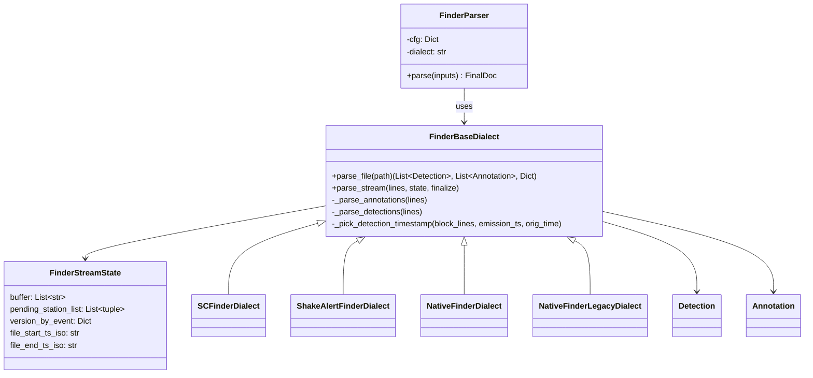
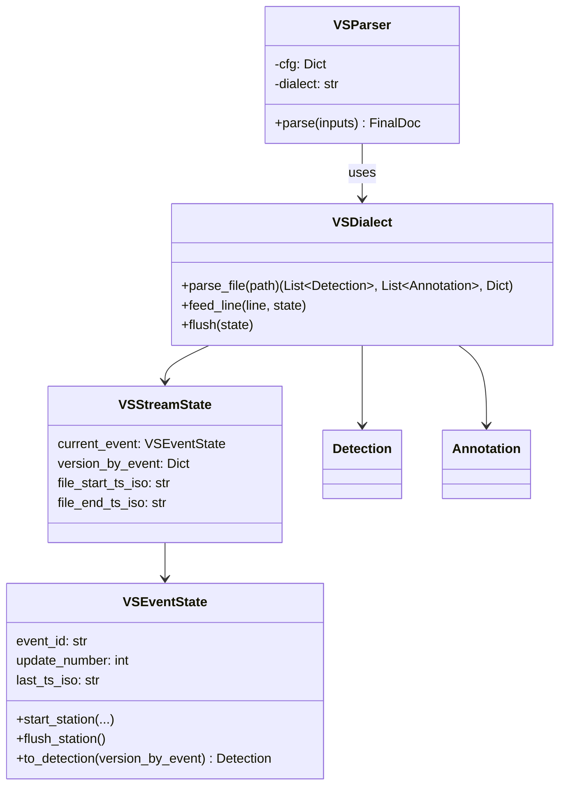

# Class Diagrams

```mermaid
classDiagram
    class FinderParser {
      -cfg: Dict
      -dialect: str
      +parse(inputs) FinalDoc
    }
    class FinderStreamState {
      buffer: List~str~
      pending_station_list: List~tuple~
      version_by_event: Dict
      file_start_ts_iso: str
      file_end_ts_iso: str
    }
    class FinderBaseDialect {
      +parse_file(path) (List~Detection~, List~Annotation~, Dict)
      +parse_stream(lines, state, finalize)
      -_parse_annotations(lines)
      -_parse_detections(lines)
      -_pick_detection_timestamp(block_lines, emission_ts, orig_time)
    }
    class SCFinderDialect
    class ShakeAlertFinderDialect
    class NativeFinderDialect
    class NativeFinderLegacyDialect
    class Detection
    class Annotation
    FinderParser --> FinderBaseDialect : uses
    FinderBaseDialect --> FinderStreamState
    FinderBaseDialect <|-- SCFinderDialect
    FinderBaseDialect <|-- ShakeAlertFinderDialect
    FinderBaseDialect <|-- NativeFinderDialect
    FinderBaseDialect <|-- NativeFinderLegacyDialect
    FinderBaseDialect --> Detection
    FinderBaseDialect --> Annotation
```

```mermaid
classDiagram
    class VSParser {
      -cfg: Dict
      -dialect: str
      +parse(inputs) FinalDoc
    }
    class VSDialect {
      +parse_file(path) (List~Detection~, List~Annotation~, Dict)
      +feed_line(line, state)
      +flush(state)
    }
    class VSStreamState {
      current_event: VSEventState
      version_by_event: Dict
      file_start_ts_iso: str
      file_end_ts_iso: str
    }
    class VSEventState {
      event_id: str
      update_number: int
      last_ts_iso: str
      +start_station(...)
      +flush_station()
      +to_detection(version_by_event) Detection
    }
    class Detection
    class Annotation
    VSParser --> VSDialect : uses
    VSDialect --> VSStreamState
    VSStreamState --> VSEventState
    VSDialect --> Detection
    VSDialect --> Annotation
```
