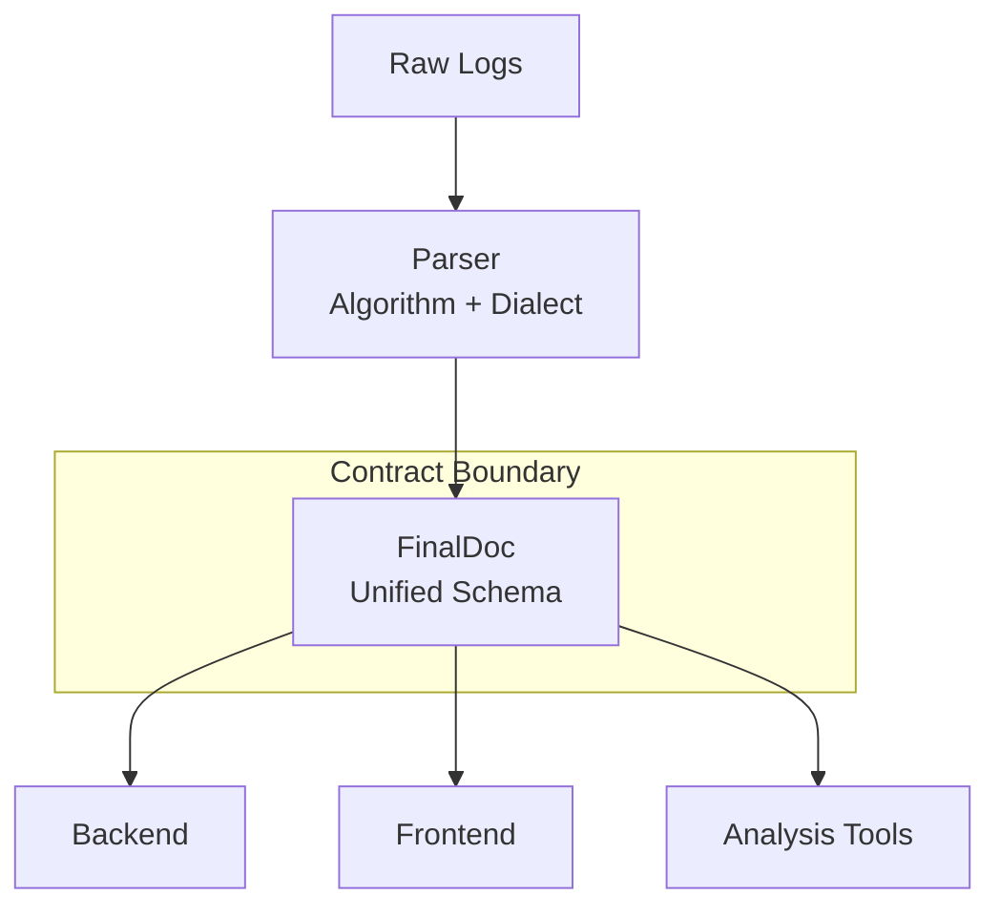
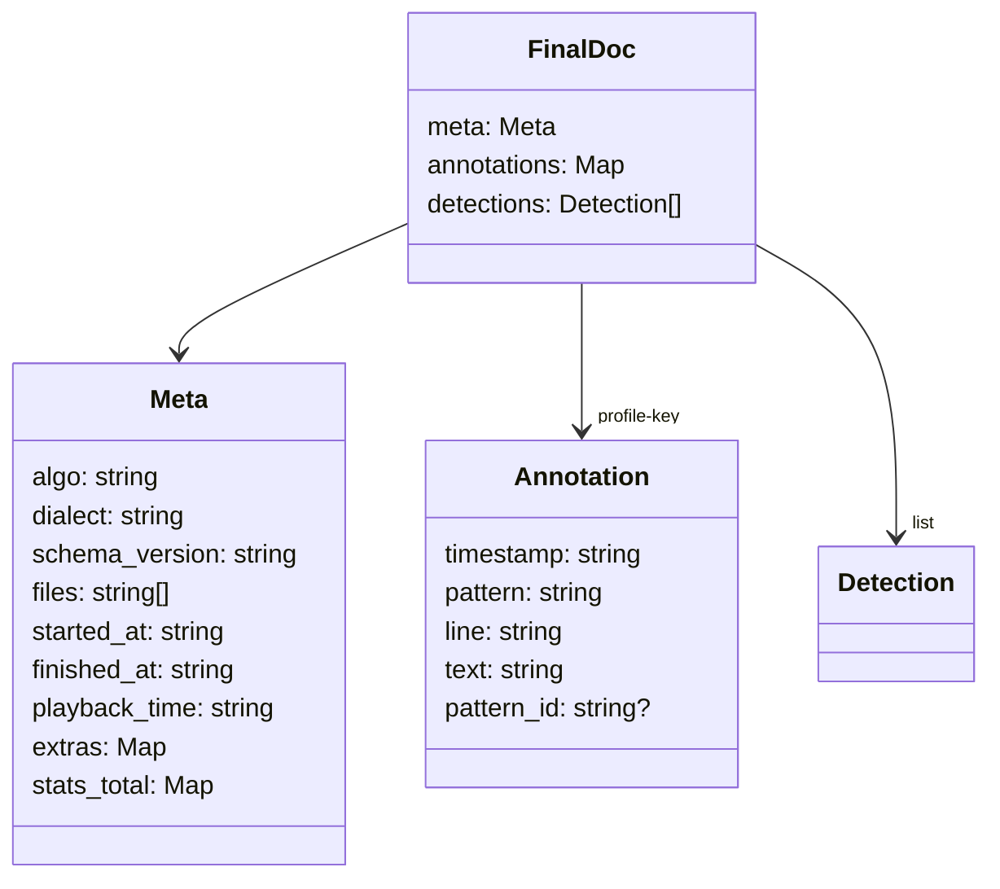
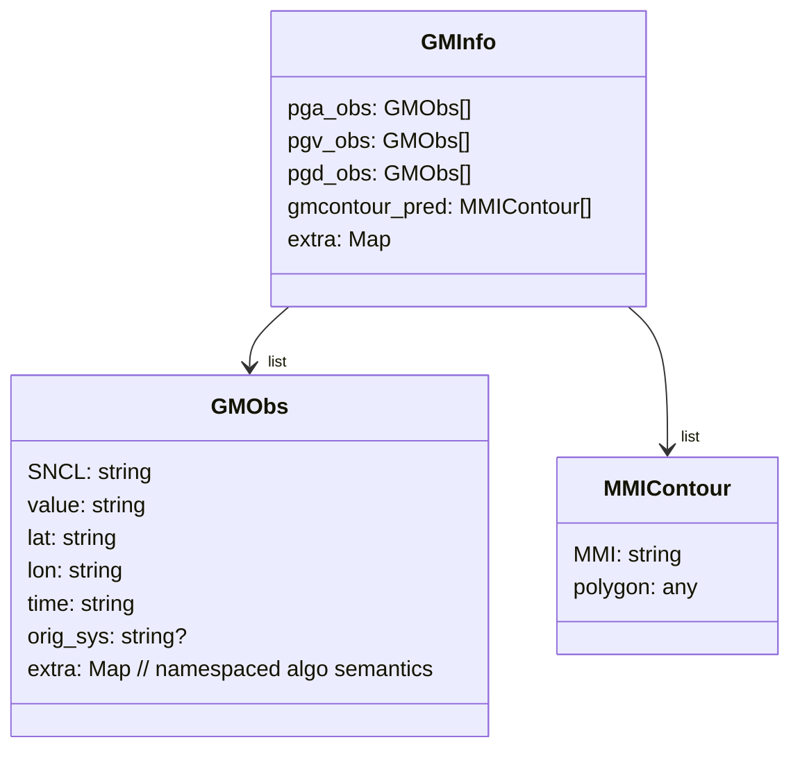

# How to Think About the EEWPW Schema
The unified schema is the stable contract between parsers and consumers. It is shared across algorithms and dialects so downstream code can rely on one shape. Three payload classes flow through it: run-level `meta`, regex/profile-driven `annotations`, and algorithm `detections`.

## End-to-End Data Flow

FinalDoc is the contract boundary: parsers emit it; backend, frontend, and analysis tools consume it unchanged.

## Top-Level Schema Structure

These three blocks exist to separate responsibilities: `meta` (run context), `annotations` (timeline hints), and `detections` (algorithm outputs). Three is sufficient and necessary for stable consumption.

## Reading a FinalDoc
- `meta` answers “what produced this file?” (algo, dialect, timing, stats, schema_version stamping).
- `annotations` answer “what interesting things happened over time?” (profile/regex hints; optional).
- `detections` answer “what did the algorithm decide?” (solutions/updates; essential payload).
- Annotations are optional. `gm_info` is optional. Detections are essential.
- The schema is frozen (for now) and backward compatible; legacy JSON/JSONL must still load. `meta.schema_version` is stamped when created and defaults to the current `SCHEMA_VERSION` (2025.1) if missing on read.

## Detection Breakdown

```mermaid
flowchart TD
    D[Detection]
    D --> H[Header Fields<br/>timestamp, event_id, category, instance, orig_sys, version]
    D --> C[core_info: DetectionCore]
    D --> G[gm_info: GMInfo::optional]
    D --> F[fault_info: FaultVertex List::optional]
    D --> V[vs_details::optional]
    D --> X[finder_details::optional]
    D --> E[extras: Map<string, any>]

    C --> C1[id, mag, lat, lon, depth, orig_time]
    C --> C2[likelihood?]
    C --> C3[vs_median_single_station_mag?]

    G --> G1[pga_obs: GMObs List]
    G --> G2[pgv_obs: GMObs List]
    G --> G3[pgd_obs: GMObs List]
    G --> G4[gmcontour_pred: MMIContour List]
    G --> G5[extra]

    F --> FV[FaultVertex<br/>lat, lon, depth?]

    V --> V1[summary: Map<string, string>]
    V --> V2[stations_not_used: string List]
    V --> V3[extra]

    X --> X1[solution_metrics: Map<string, string>]
    X --> X2[origin_time_epoch?]
    X --> X3[solution: Map<string, string>]
    X --> X4[finder_flags?: Map<string, string>]
    X --> X5[extra]
```

Header + `core_info` form the required spine. Optional regions capture ground motion, rupture geometry, and algo-specific details. Back-compat behaviors: `fault_info` of `None` or `{}` becomes `[]`; `gm_info` of `None` or `{}` yields an empty `GMInfo`; dict payloads keep unknown keys under `gm_info.extra`; `GMObs.orig_sys` is filled from detection `orig_sys` when missing. `fault_info` carries rupture vertices for FinDer when a rupture is produced; other algorithms leave it empty.

## Ground Motion: Station-Centric by Design
`GMObs` are station-centric (SNCL-level) so observations from multiple algorithms merge cleanly and keep formatting stable. Algorithm semantics (component, wavetype, etc.) live in namespaced entries under `GMObs.extra` (e.g., `extra["vs"]`), preventing collisions while preserving the core fields. This keeps mixed-algorithm observations compatible in a single document.


## Annotations: Timeline Hints, Not Detections
Annotations are regex/profile-based hints keyed by frontend profile IDs. Namespacing rule: `pattern_id = "{algo}/{dialect}:{rule_id}"`, which is required for merged or multi-algo views to avoid collisions.

## Minimal Example (Annotated)
This example shows the unified shape with one detection, one annotation, and one ground-motion observation. Optional blocks are empty where unused, and numeric values remain strings to preserve formatting.
```json
{
  "meta": {
    "algo": "vs",
    "dialect": "scvsmag",
    "schema_version": "2025.1",
    "files": ["example.log"],
    "started_at": "2025-12-23T19:35:40Z",
    "finished_at": "2025-12-23T19:35:50Z",
    "extras": {},
    "stats_total": {"detections": 1}
  },
  "annotations": {
    "time_vs_magnitude": [
      {
        "timestamp": "2025-12-23T19:35:49Z",
        "pattern": "mag_update",
        "line": "42",
        "text": "Updated M=3.2 at 19:35:40Z",
        "pattern_id": "vs/scvsmag:mag_update"
      }
    ]
  },
  "detections": [
    {
      "timestamp": "2025-12-23T19:35:48Z",
      "event_id": "20251223193548-001",
      "category": "update",
      "instance": "vs@harness",
      "orig_sys": "vs",
      "version": "1",
      "core_info": {
        "id": "20251223193548-001",
        "mag": "3.2",
        "lat": "45.123",
        "lon": "-122.456",
        "depth": "10.0",
        "orig_time": "2025-12-23T19:35:40Z"
      },
      "fault_info": [],
      "gm_info": {
        "pga_obs": [
          {
            "SNCL": "ABC..HHZ",
            "value": "0.05",
            "lat": "45.000",
            "lon": "-122.000",
            "time": "2025-12-23T19:35:45Z",
            "extra": {
              "vs": {"component": "Z"}
            }
          }
        ],
        "pgv_obs": [],
        "pgd_obs": [],
        "gmcontour_pred": [],
        "extra": {}
      },
      "extras": {}
    }
  ]
}
```
- `pattern_id` follows `{algo}/{dialect}:{rule_id}` for namespace safety.
- Numeric values are strings to preserve formatting.
- `extra` holds algorithm semantics (e.g., `"vs": {...}`) without altering the core schema.

## Design Invariants and Non-Goals
- Schema is frozen but extensible via `extra`; backward compatibility is mandatory.
- Parsers stamp `meta.schema_version`; when reading, a missing value defaults to the current `SCHEMA_VERSION` while preserving any stamped value. Backend never invents a new version.
- This document is not an algorithm or API reference.
